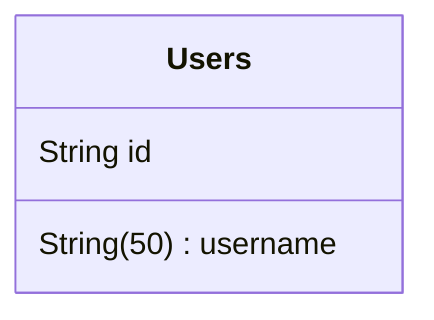
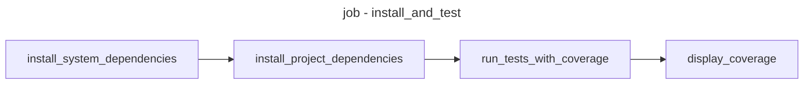

## :construction: Installation

### Minimum requirements

- [Python](https://www.python.org/) 3.10
- [Poetry](https://python-poetry.org/) 1.4.2
- [Docker](https://docs.docker.com/install/) 20.10.23
- [Docker Compose](https://docs.docker.com/compose/install/) 2.15.1

### Install the application locally

- Run `git clone git@github.com:your-organisation/symeo-python-template.git` or `git clone https://github.com/your-organisation/symeo-python-template.git` to clone the repository
- Run `pre-commit install` to set up the git hook scripts
- Run `poetry install` to install node dependencies
- Run `docker-compose up` to start the local PostGreSQL Database
- Run `cp properties/local.example.ini properties/local.ini` and `cp secrets/local.example.ini secrets/local.ini` to copy the example .ini files
- Edit the created `properties/local.ini` and `secrets/local.ini` files with the relevant variable values
- Run `poetry run python3 src/bootstrap/main.py properties:properties/local.ini secrets:secrets/local.ini` to start the application. See this section to understand the use of arguments in the command line

## :wrench: Development

### Coding conventions

The coding conventions and style are enforced by the [ruff](https://beta.ruff.rs/docs/) linter and the [black](https://github.com/psf/black) formatter. The configuration can be found in the [pyproject.toml](pyproject.toml).

To check linting error in command line, run `poetry run ruff check <target_directory>`.

To fix automatically format errors, run `poetry run black <target_directory>`.

To check all coding conventions before committing to your remote repo we use [pre-commit](https://pre-commit.com/) hooks. If you didn't already run `pre-commit install` right after cloning the repo, you should do it now.

We use [swagger](https://swagger.io/) to generate the documentation of our API
- Launch the application with `poetry run python3 src/bootstrap/main.py properties:properties/local.ini secrets:secrets/local.ini` and then go to your browser and type `http://localhost:9999/docs` to see the documentation of the API.

## :office: Architectures

### Structure

The source code is contained in the `/src` directory:

```text
src
├── application
│   └── rest_api_adapter
│       ├── controller
│       │   └── user_controller.py
│       ├── dto
│       │   └── user
│       │       ├── get_user_dto.py
│       │       ├── post_user_dto.py
│       │       └── user_dto.py
│       └── mapper
│           └── user
│               └── user_mapper.py
├── bootstrap
│   └── main.py
├── domain
│   ├── __init__.py
│   ├── configuration
│   │   └── configuration_service.py
│   ├── exception
│   │   └── exceptions.py
│   ├── model
│   │   └── user_model.py
│   ├── port
│   │   ├── input
│   │   │   └── user_facade.py
│   │   └── output
│   │       └── user_storage_port.py
│   └── service
│       └── user_service.py
└── infrastructure
    └── postgres_adapter
        ├── adapter
        │   └── postgres_user_adapter.py
        ├── alembic
        │   ├── README
        │   ├── env.py
        │   ├── script.py.mako
        │   └── versions
        │       ├── 4807754e549a_init_user_table.py
        ├── entity
        │   └── user_entity.py
        ├── mapper
        │   └── user_mapper.py
        └── utils
            └── postgres_utils.py
```

The structure of this project follows **Hexagonal-Architecture** and **Domain-Driven-Design** principles and is seperated into 4 main folders:
1. `/application`: it will contain all the adapters related to your "application". For now, you will only find one application adapter (`rest-api-adatper`) containing
the route endpoints (`/application/rest-api-adapter/controller`) as well as the DTOs of those endpoints (`/application/rest-api-adapter/dto`).
2. `/domain`: this is where all the business logic has to be. You will find the `models`, the different ports `/domain/port/input` and `/domain/port/output` on which you will plug your adapters and finally your `services`.
See the [configuration](#configuration) section to understand the role of the `configuration` folder.
3. `/infrastructure`: this is where all your adapters related to your infrastructure should be. For now, you will only find one adapter which is a `postgres-adapter`.
4. `/bootstrap`: this is where you will bootstrap your project by making [dependency injections](#dependency-injection).

More about hexagonal architecture : [blog post](https://blog.octo.com/architecture-hexagonale-trois-principes-et-un-exemple-dimplementation/)

### Framework

The framework used for this project is FastAPI. It is used to build Python 3.7+ server-side application.

FastAPI uses Starlette as a framework for HTTP servers by default.
Data validation is made thanks to Pydantic.

#### Official documentations

- [FastAPI](https://fastapi.tiangolo.com/)
- [Starlette](https://www.starlette.io/)
- [Pydantic](https://docs.pydantic.dev/latest/)

### Database

#### PostgreSQL, SQLAlchemy and Alembic

In this project, you will find a simple postgresSQL database configured with Docker as well as [SQLAlchemy](https://www.sqlalchemy.org/) for your ORM and [Alembic](https://alembic.sqlalchemy.org/en/latest/)
used to manage and run database migrations.

**PostgreSQL**

To start your local database, run the following command at the root of your project:

```shell
docker-compose up
```

**Alembic**

You will find in the [postgres-adapter](src/infrastructure/postgres_adapter) an alembic folder containing the migrations of your database.
For now, only one migration exists and is named [4807754e549a_init_user_table.py](src/infrastructure/postgres_adapter/alembic/versions/4807754e549a_init_user_table.py).
All the alembic migrations are run at runtime. If you look into the [main.py](src/bootstrap/main.py) file (the entrypoint of the app), you will find those lines of code:

```python
alembic_config_path = (
    os.path.dirname(os.path.abspath(__file__)) + "/../../alembic.ini"
)
alembic_config = Config(alembic_config_path)
database_url = get_postgres_url(configuration_service, test_container_url)
escaped_database_url = database_url.replace("%", "%%")
alembic_config.set_section_option("alembic", "sqlalchemy.url", escaped_database_url)
alembic_config.set_section_option(
    "alembic",
    "script_location",
    os.path.dirname(os.path.abspath(__file__))
    + "/../infrastructure/postgres_adapter/alembic",
)
# alembic.command.upgrade(alembic_config, 'head') # Run migrations at runtime
```

- We first indicate to alembic where to find the config file `alembic.ini` (e.g. at the root of our project).
- We then get the url of our started database.
- Finally, that is the last line of code that tells alembic to move the state of our database to its latest version (`head`), by running migrations if it has to.

To create a new migration you can run the following command:

```shell
poetry run alembic revision -m "name_of_your_migration"
```

**SQLAlchemy**

SQLAlchemy is used as our ORM, you can find an example of its usage in the [postgres_user_adapter.py](src/infrastructure/postgres_adapter/adapter/postgres_user_adapter.py) file.

First, we initiate a connection with our database by creating a `context`.
```python
@contextmanager
def __get_connection_session(self) -> Generator:
    engine = create_engine(self.__database_url, pool_pre_ping=True)
    connection: sessionmaker[Session] = sessionmaker(
        autocommit=False, autoflush=False, bind=engine
    )
    try:
        yield connection()
    finally:
        connection().close()
```

We then, can use this connection to create queries to our database (in this case, to fetch a user based on its id)

```python
def get_user(self, user_id: str) -> Optional[User]:
    with self.__get_connection_session() as connection:
        user_entity = (
            connection.query(UserEntity).filter(UserEntity.id == user_id).first()
        )
        if user_entity is None:
            return None
        return UserMapper.from_entity_to_domain(user_entity)
```

### Data model

For now, only one table (users) is present as an example in the project.



## gunicorn config

You can find a `gunicorn` directory at the root of the project where you will find a [gunicorn.conf.py](gunicorn/gunicorn.conf.py) file.

This file is provided to the start command line in the [Dockerfile](Dockerfile). It uses the [multiprocessing](https://docs.python.org/3/library/multiprocessing.html) python library
to calculate the number of worker that we can start on the server in order to prevent it from killing the process.

## :rocket: Infrastructure

### Entrypoint

The entrypoint of your application is the `main.py` file located at `/src/bootstrap/main.py`. Our bootstrap method looks like this:

```python
def bootstrap(
    input_args: List[str], test_container_url: Optional[str] = None
) -> FastAPI:
    configuration_service = ConfigurationService()
    configuration_service.init_from_args(input_args)

    alembic_config_path = (
        os.path.dirname(os.path.abspath(__file__)) + "/../../alembic.ini"
    )
    alembic_config = Config(alembic_config_path)
    database_url = get_postgres_url(configuration_service, test_container_url)
    escaped_database_url = database_url.replace("%", "%%")
    alembic_config.set_section_option("alembic", "sqlalchemy.url", escaped_database_url)
    alembic_config.set_section_option(
        "alembic",
        "script_location",
        os.path.dirname(os.path.abspath(__file__))
        + "/../infrastructure/postgres_adapter/alembic",
    )
    # alembic.command.upgrade(alembic_config, 'head') # Run migrations at runtime

    postgres_user_adapter: PostgresUserAdapter = PostgresUserAdapter(database_url)
    user_service: UserService = UserService(postgres_user_adapter)

    app = FastAPI(title="Your API")
    api_router = APIRouter()
    api_router.include_router(
        UserController(user_service).build(),
        prefix="/users",
        tags=["users"],
    )
    app.include_router(api_router, prefix="/api/v1")
    app.include_router(add_health_check(), tags=["tech"])
    return app
```

We can see three main parts in this method:

1. The initialization of our `ConfigurationService` explained [here](#configuration).
2. The alembic part used to run our [migrations](#postgresql-sqlalchemy-and-alembic) at runtime.
3. The initialization of our FastAPI application with [dependency injections](#dependency-injection).

### Dependency injection

We achieve our dependency injection as follows:

```python
postgres_user_adapter: PostgresUserAdapter = PostgresUserAdapter(database_url)
user_service: UserService = UserService(postgres_user_adapter)

app = FastAPI(title="Your API")
api_router = APIRouter()
api_router.include_router(
    UserController(user_service).build(),
    prefix="/users",
    tags=["users"],
)
app.include_router(api_router, prefix="/api/v1")
```

### Configuration

In this project, we use `.ini` files in order to organize our configuration values. We also created a `ConfigurationService` that we initialize during
the bootstrap of our application by writing those two lines of code in our `main.py`:

```python
configuration_service = ConfigurationService()
configuration_service.init_from_args(input_args)
```

You can find this `ConfigurationService` in the domain part of the application in the [configuration_service.py](src/domain/configuration/configuration_service.py) file.
This service allows us to provide any path to configuration properties/secrets file as arguments of our startup command line.

As explained in the "[Install the application locally](#install-the-application-locally)" part, we launch our application by adding
`properties:properties/local.ini secrets:secrets/local.ini` as arguments in our command line. This tells our application to fetch the configuration properties in the [properties/local.ini](properties/local.ini) file and the configuration secrets in the [secrets/local.ini](secrets/local.ini) file.

### Endpoints and Services

As examples in this project, 2 endpoints can be accessed:

- `(GET) /users/:id` : get a user by its id.
- `(POST) /users` : create a user.

> See the section about swagger [here](#coding-conventions) to have a better understanding of those endpoints and the data required.

This template has only **one service** called `user_service_py` which contain two methods. The first one to retrieve a user by its id and the
other to create one.

## :white_check_mark: Testing strategy

The tests are carried out using the [pytest](https://docs.pytest.org/en/7.3.x/) library.

Faker values are generated with the [faker](https://faker.readthedocs.io/en/master/) library.

### Commands

- Use `poetry run pytest` to launch all tests.
- Use `poetry run coverage run -m pytest tests` to launch all tests and get coverage report.
- Use `poetry run coverage report` to display your coverage report

### Test Structure

#### Unit Tests

You will find an example of unit tests in `/tests/unit/service` used to test the behavior of the example service `user_service_py`.

In those tests, we do not reach external dependencies. Therefore, we must mock things like database access, external api access, etc...

#### Integration Tests

Those tests are located in `/tests/integration` and are here to test the global behavior of our API. We must fake a start of our application and this is done
by the `abstract_integration_test.py` file located in `/tests/integration/`.

## :vertical_traffic_light: Continuous Integration

A configuration for [circleci](https://circleci.com/) is already present in this project at `.circleci/config.yml`.

Only one job (`install_and_test`) is present in it and the steps of this job are:



> :rotating_light: **Important**: We use [TestContainer](https://testcontainers-python.readthedocs.io/en/latest/README.html) in order to carry out
> integration tests. Under the hood, TestContainer start a PostgreSQL docker container. That is why we are using a linux VM as `execution environment`.
